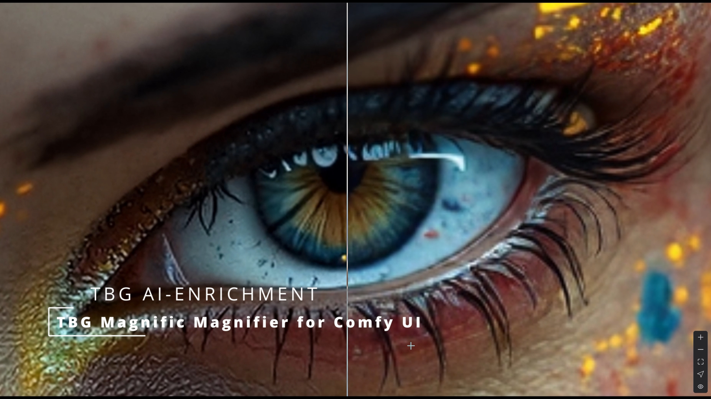
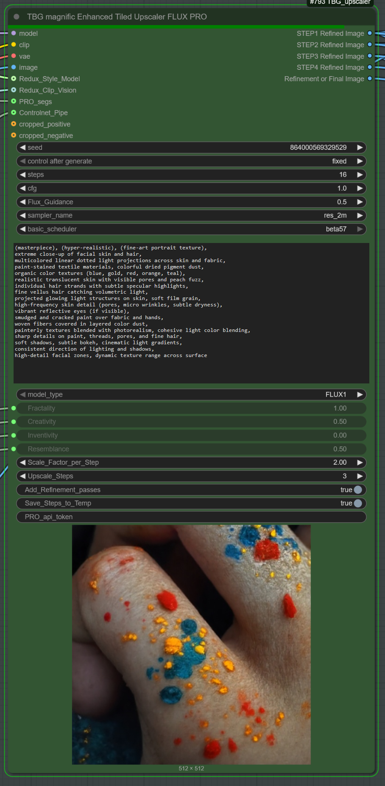
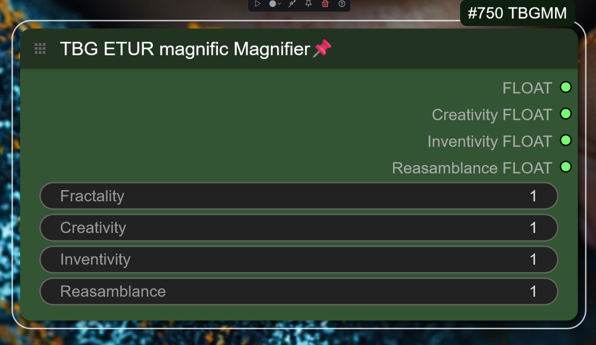

  
# TBG Magnific Magnifier Node for ComfyUI

The **TBG Magnific Magnifier** node is an advanced yet simple-to-use enhancement tool designed for tiled image generation and refinement within ComfyUI. It uses cutting-edge neuro-generative tile fusion and multi-path processing pipelines tailored for extreme resolution workflows — supporting images up to (but not limited to) 100 megapixels with high fidelity or high freedom.

The TBG Magnific Magnifier **enables multi-step automatic upscaling** with very simple, easy-to-use settings like **Creativity, Reassemblance, Fractality,** and **Inventivity**, giving users powerful control without complexity.

## Key Features

- **AI Image Enhancement**  
  Applies advanced algorithms to significantly improve image visual quality.

- **High-Resolution Generation**  
  Produces images with exceptional clarity and fine detail, even at ultra-high resolutions.

- **Image Polishing**  
  Smooths and refines visuals for a clean, professional finish.

- **Neuro-Generative Tile Fusion**  
  Seamlessly fuses tiled images into a coherent, artifact-free whole.

- **User-Friendly Interface**  
  The CE (Community Edition) offers straightforward and intuitive controls, while the PRO version provides extensive customization options for advanced users.

---

## Parameter Overview
  

### 🔹 **Fractality**

> A tile size multiplier controlling detail randomness during upscaling.

- **Lower values**: introduce more randomness and abstract patterns.  
- **Higher values**: retain more of the original image’s structure.  

**Impact:**  
Fractality determines how much fractal-like detail is generated.  
⚠️ **Higher values require exponentially more GPU memory!**

> My test settings require around **28GB VRAM** during the refinement pass.  
If you're not using an RTX 5090, consider lowering Fractality, turning off the refinement pass, or using GGUF/optimization techniques to reduce VRAM usage.

---

### 🔹 **Creativity**

> Controls the balance between faithful detail preservation and creative freedom.

- **Lower values**: yield consistent, refined results that closely follow the input.  
- **Higher values**: allow for reinterpretation, abstract variations, and novel detail generation.

**Impact:**  
Affects how "safe" or "imaginative" the upscale becomes.  
Creativity is automatically **scaled down** during **multi-step upscaling** to maintain control.

---

### 🔹 **Inventivity**

> Boosts micro-detail creation and enhances or invents textures.

- Adds realistic or artistic **small-scale details** that may not exist in the original.  
- Particularly useful in **low-resolution** areas or flat surfaces.

**Impact:**  
Inventivity enhances perceived richness in skin, fabric, nature, and more.  
🧠 **Tip:** Prompt phrasing significantly affects Inventivity. In some cases, you may need to **lower flux guidance** to retain control.

---

### 🔹 **Reassemblance (Anchor)**

> Connects structure consistency to **ControlNet**, **Redux**, and **IPAdapter** features.

- **High values**: strongly preserve original layout and mega-structures.  
- **Low values**: allow for more freedom and restructuring.

**Impact:**  
Guides structural consistency during multi-step upscaling.  
Reassemblance dynamically adapts to Redux/ControlNet inputs.

---

### 🔹 **Refinement Pass**

> An optional final step that enhances fine details after the upscale.

- Produces **sharper, cleaner, more complete** results.  
- ⚠️ **Requires significantly more GPU memory** than standard steps.

**Use with caution** if you're on limited VRAM. Consider disabling it or optimizing other parameters to save memory.
  

---

## New Fusion Techniques use from TBG Enhanced Tiled Upscaler and Refiner Pro
### PRO Neuro-Generative Tile Fusion (NGTF)  
An advanced generative system that “remembers” newly generated surroundings and dynamically adapts subsequent sampling steps. This enables high-denoise tile refinement with:  
- Global consistency across the entire image  
- Sharp, coherent details  
- Preservation of contextual relationships between tiles

---

This combination of technologies empowers the TBG Magnific Magnifier node to deliver high-quality, large-scale image generation and refinement workflows that maintain both detail and cohesion at massive resolutions — all while keeping the user experience smooth and accessible.

The TBG ETUR Magnific Magnifier requires a Pro, Premium, or Unlimited membership. However, you can achieve the same results using the TBG Enhanced Upscaler and Refiner PRO with manual settings and a Free membership.

**Note: This node is now merged with the [ComfyUI-TBG-ETUR Enhanced Tiled Upscaler & Refiner Pro](https://github.com/Ltamann/ComfyUI-TBG-ETUR) project.**
